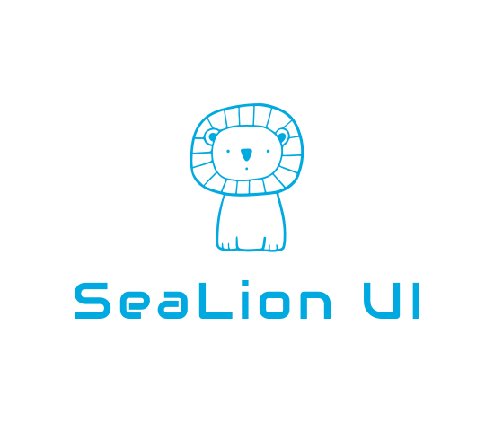

[中文](README.md) | English

<div align="center">

[](https://github.com/jsweber/sea-lion-uix)

React component library built on Radix Primitives. Theme and Headless modes.

[📖 Documentation](https://jsweber.github.io/sea-lion-uix/?path=/story/%E6%80%BB%E8%A7%88-web-playground--app) · [GitHub](https://github.com/jsweber/sea-lion-uix)

</div>

---

## Introduction

Sea-lion-uix (or **x**) is the next generation of [sea-lion-ui](https://github.com/jsweber/sea-lion-uix), rebuilt on [Radix Primitives](https://www.radix-ui.com/primitives). It ships **49** components—buttons, forms, layout, feedback, data display—each as a separate package for install-on-demand.

## Features

- **Independent packages**: Install and upgrade per component; no bloat when used with other UI libraries
- **Theme & Headless**: Use with theme styles or in headless (unstyled) mode
- **Theme panel**: Visually tune brand colors, neutrals, dark mode, radius, fonts, shadows, and more
- **Flexible API**: asChild, Slot, exposed state; follows Radix’s styling approach
- **Stack-friendly**: Less + CSS custom properties; works with eslint-config-ali, iconfont

## Installation

Install only the packages you need. No single “kitchen sink” bundle.

```bash
# Install a component (e.g. Button)
pnpm add @sea-lion/react-button

# Install Theme when you want default styles
pnpm add @sea-lion/react-theme
```

Without Theme, components run in headless mode (no default styles).

## Quick Start

```tsx
import { Theme } from '@sea-lion/react-theme';
import { Button } from '@sea-lion/react-button';

export default function App() {
  return (
    <Theme>
      <Button>Click me</Button>
    </Theme>
  );
}
```

See the [documentation](https://jsweber.github.io/sea-lion-uix/?path=/story/%E6%80%BB%E8%A7%88-web-playground--app) for more components and examples.

## Development

### Requirements

- Node >= 18
- pnpm >= 9

### Setup and run

```bash
git clone https://github.com/jsweber/sea-lion-uix.git
cd sea-lion-uix
pnpm install
pnpm dev
```

`pnpm dev` builds Theme assets and starts Storybook at http://localhost:6006.

### Scripts

| Command | Description |
|---------|-------------|
| `pnpm dev` | Build Theme and start Storybook |
| `pnpm build` | Build all packages and Theme |
| `pnpm build-storybook` | Build Storybook static output only |
| `pnpm publish-stable` | Build, run changeset, and publish |

### Documentation (GitHub Pages)

1. In repo **Settings → Pages**, set **Source** to **GitHub Actions**
2. Push to `main` or run the “Deploy Storybook to GitHub Pages” workflow from **Actions**
3. Docs will be available at `https://<owner>.github.io/sea-lion-uix/`

## Contact

Questions or suggestions: **dxqweber@gmail.com**.

## License

ISC
